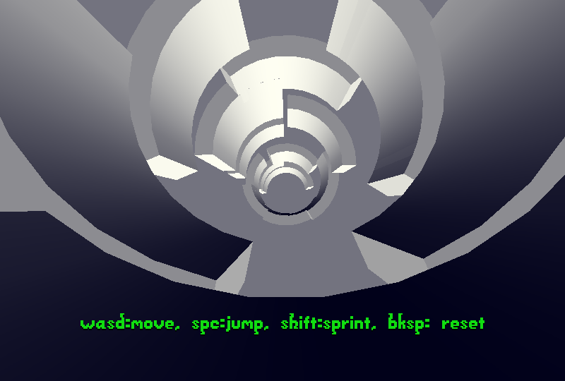

# Hyperloop

Author: Colin Gay

Design: Run and jump your way through a tunnel that defies gravity.

Screen Shot:

How To Play:

WASD to move, Space to jump, Shift to sprint, Backspace to reset.
Your goal is to reach the yellow objective at the end of the tunnel.
ESC to quit.

Sources:

All assets used are rendered using Blender v2.8. Credit to Jim McCann for base 3D assets and Blender pipeline. Level design by Colin Gay.

This game was built with [NEST](NEST.md).
